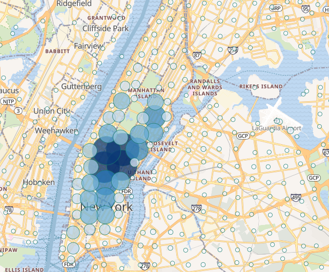
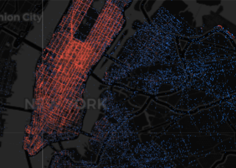
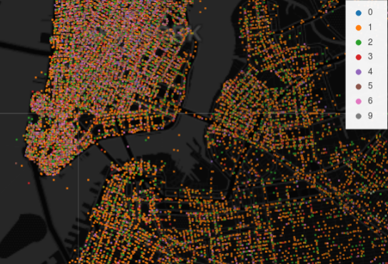
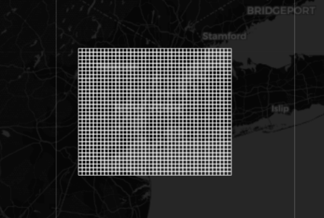

# Elastic Datashader

Python Jupyter Notebook that shows how to efficently render geospatial data
from ElasticSearch via [Datashader](datashader.org), so that instead of this:

You get this:

This is accomplished by taking a bounding-box query area (potentially the entire
world).

Then sub-dividing it into smaller individual queries that can be executed
in parallel at a higher-precision.

These individual queries are reduced into a single dataframe before being
rendered via Datashader.
